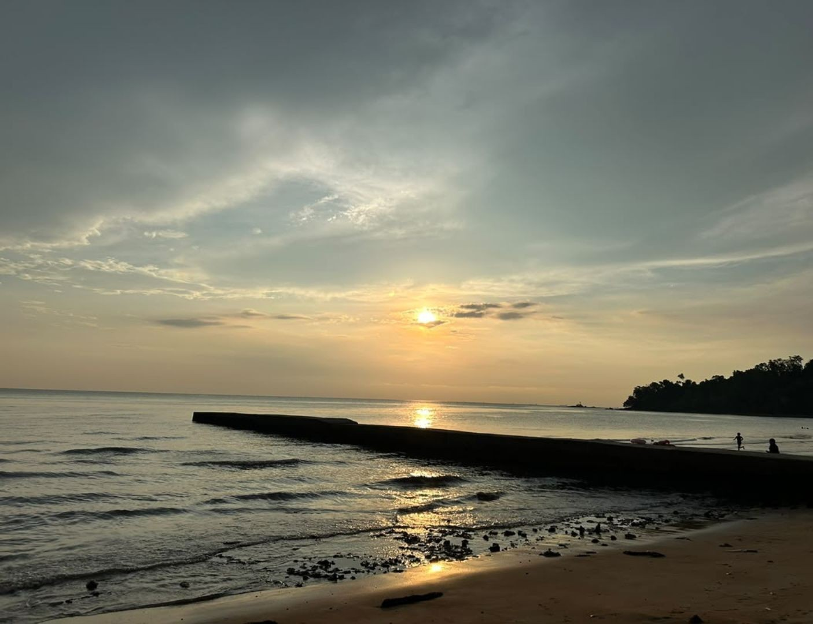

# Introduction 
Hi! I'm Auni Nafisa, a student in the Software Maintenance and Evolution course. I expect to learn more about software maintenance, software evolution and how to improve existing software systems throughout this course.
**Fun fact**: I love the beach and the sea because being near the water makes me feel peaceful.
**Course expectations**: I hope to gain a better understanding of maintaining and improving software, understanding legacy systems, applying better coding practices and learning how to make software more reliable and easier to maintain.

